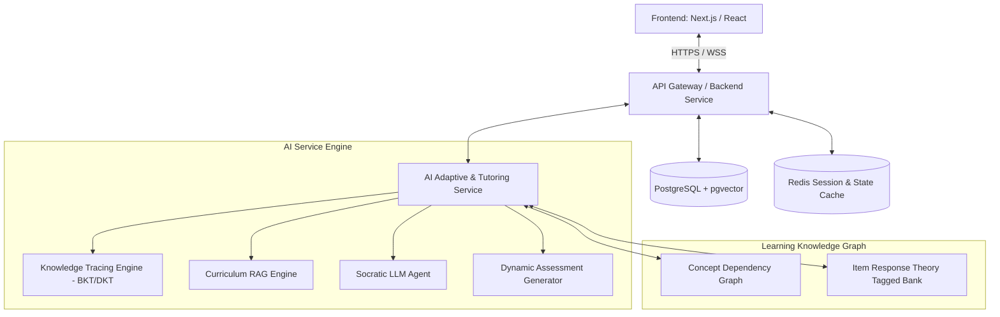
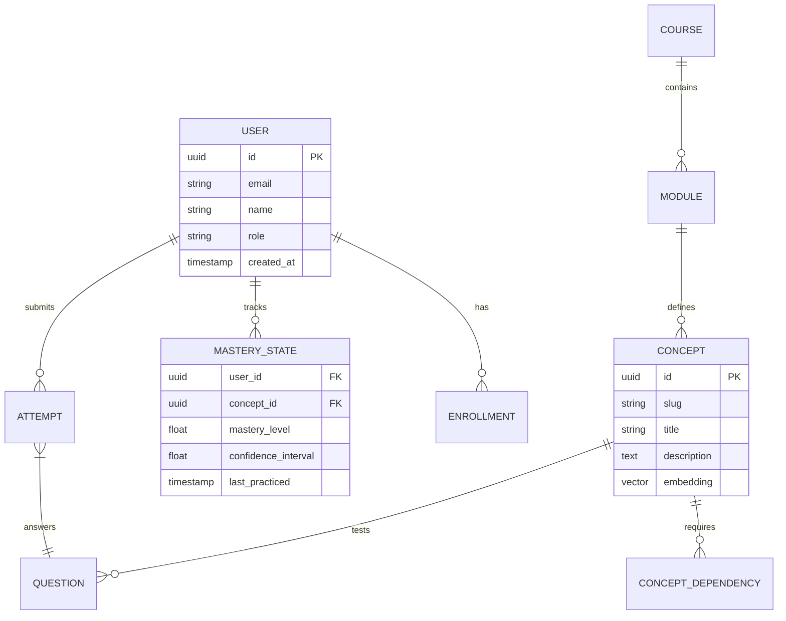

# SmartLearn — Technical Specification & Architecture

## 1. Executive Summary
**SmartLearn** is an AI-powered, adaptive learning platform engineered to personalize educational journeys in real time. It continuously tracks learner mastery, diagnoses misconceptions, dynamically adjusts curriculum pathways, and provides interactive AI tutoring utilizing Socratic pedagogy.

---

## 2. System Architecture



---

## 3. Core Modules & Directory Layout

```
smartlearn/
│
├── PROJECT_SPEC.md            # System specification & architectural standards
├── README.md                  # Quickstart, local dev setup, and overview
│
├── frontend/                  # Modern client application
│   ├── src/
│   │   ├── components/        # Reusable UI elements (charts, mastery graphs, chat)
│   │   ├── pages/ or app/     # Learning dashboard, lesson viewer, tutor chat
│   │   ├── hooks/             # WebSocket and state management hooks
│   │   └── services/          # API client layer
│   ├── package.json
│   └── README.md
│
├── backend/                   # Core business logic, auth & persistence
│   ├── src/
│   │   ├── controllers/       # HTTP request handlers
│   │   ├── models/            # Database schema & ORM models
│   │   ├── routes/            # REST & WebSocket route definitions
│   │   ├── services/          # Business logic, auth, telemetry
│   │   └── middleware/        # JWT auth, rate limiting, logging
│   ├── package.json or pyproject.toml
│   └── README.md
│
├── ai/                        # AI/ML personalization & tutor service
│   ├── models/                # Knowledge tracing models (BKT, DKT, IRT)
│   ├── rag/                   # Embeddings, vector indexing, retrieval
│   ├── tutor/                 # Socratic prompt templates, guardrails, agent chains
│   ├── assessment/            # Dynamic question generator & evaluator
│   ├── requirements.txt
│   └── README.md
│
├── learning/                  # Knowledge representations & content assets
│   ├── graphs/                # Concept prerequisite graphs (JSON/YAML)
│   ├── curriculums/           # Subject hierarchies (e.g., Math, CS, Science)
│   └── question_banks/        # IRT-calibrated problem sets with hints & solutions
│
└── docs/                      # Developer guides and system documentation
    ├── ARCHITECTURE.md        # Deep dive into data pipelines and algorithms
    ├── API_SPEC.md            # OpenAPI / REST & WebSocket contracts
    └── ROADMAP.md             # Milestone deliverables
```

---

## 4. Key AI & Pedagogical Algorithms

### 4.1 Knowledge Tracing (Bayesian Knowledge Tracing / Deep Knowledge Tracing)
- **State Estimation**: Measures probability $P(L_t)$ that a student has mastered a concept node at step $t$.
- **Parameters**:
  - $P(L_0)$: Initial mastery probability.
  - $P(T)$: Transition probability (learning from practice).
  - $P(G)$: Guess probability (correct answer despite non-mastery).
  - $P(S)$: Slip probability (incorrect answer despite mastery).

### 4.2 Dynamic Concept Dependency Graph
- Directed Acyclic Graph (DAG) of prerequisites.
- If mastery on concept $C_k < \tau_{threshold}$, the path generator steps back to prerequisite concepts $C_{pre} \in Parent(C_k)$ and diagnoses misconceptions.

### 4.3 Socratic AI Tutor with Guardrails
- **Pedagogical Strategy**: Never supply direct solutions immediately. Break down problems into guiding questions.
- **RAG Grounding**: Responses are grounded in validated curriculum textbooks and curated knowledge stores using semantic similarity over vector embeddings.
- **Tone & Adaptivity**: Matches learner cognitive load (novice, intermediate, advanced).

---

## 5. Database Schema (Relational & Vector)



---

## 6. API Specifications (Overview)

### 6.1 Authentication & Profile
- `POST /api/v1/auth/register` — Create new learner/educator account.
- `POST /api/v1/auth/login` — Authenticate and receive JWT tokens.
- `GET /api/v1/users/me` — Current user profile and global mastery snapshot.

### 6.2 Learning Paths & Recommendations
- `GET /api/v1/learning-paths/:courseId` — Get dynamic, personalized learning roadmap.
- `GET /api/v1/concepts/:conceptId/next-action` — Get next recommended activity (lesson, drill, assessment, review).

### 6.3 Real-Time Tutor (WebSocket / SSE)
- `WSS /ws/v1/tutor` — Interactive bidirectional Socratic chat with streaming tokens, LaTeX formula rendering, and misconception logging.

### 6.4 Assessments & Telemetry
- `POST /api/v1/assessments/submit` — Submit answer; triggers knowledge tracing update and real-time feedback.
- `POST /api/v1/telemetry/event` — Log learner interactions (time on question, hint requests, retry count).

---

## 7. Security & Compliance
- **Authentication**: JWT with refresh token rotation + RBAC (Student, Teacher, Admin).
- **Data Protection**: Encryption at rest (AES-256) and in transit (TLS 1.3).
- **AI Safety**: Input moderation filters, prompt injection defenses, output hallucination guardrails.
