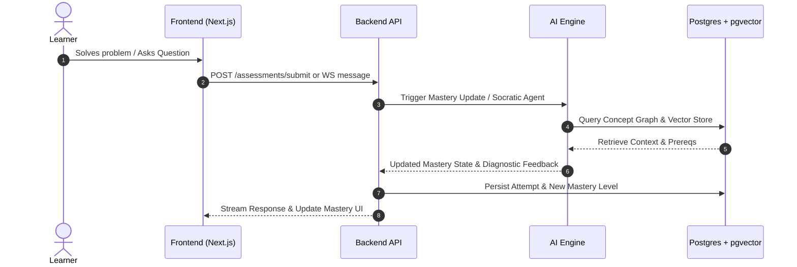

# SmartLearn System Architecture & Technical Design

## 1. High-Level Data Flow

---

## 2. Pedagogical Engine: Bayesian Knowledge Tracing (BKT)

The probability that a student has mastered skill $k$ at interaction $t$ given observation $obs_t \in \{correct, incorrect\}$ is updated via Bayes' rule:

$$P(L_t | obs_t = correct) = \frac{P(L_t) \cdot (1 - P(S))}{P(L_t) \cdot (1 - P(S)) + (1 - P(L_t)) \cdot P(G)}$$

$$P(L_t | obs_t = incorrect) = \frac{P(L_t) \cdot P(S)}{P(L_t) \cdot P(S) + (1 - P(L_t)) \cdot (1 - P(G))}$$

Following each interaction, the prior for the subsequent step incorporates the transition probability $P(T)$:

$$P(L_{t+1}) = P(L_t | obs_t) + (1 - P(L_t | obs_t)) \cdot P(T)$$

---

## 3. Dynamic Path Recommendation Logic
1. **Graph Traversal**: Inspect child nodes of mastered concepts.
2. **Zone of Proximal Development (ZPD)**: Filter target concepts where prerequisite mastery $> 0.80$ but concept mastery $< 0.85$.
3. **Spaced Repetition Decay**: Apply Ebbinghaus forgetting curve decay to previously mastered concepts to schedule timely review drills.
